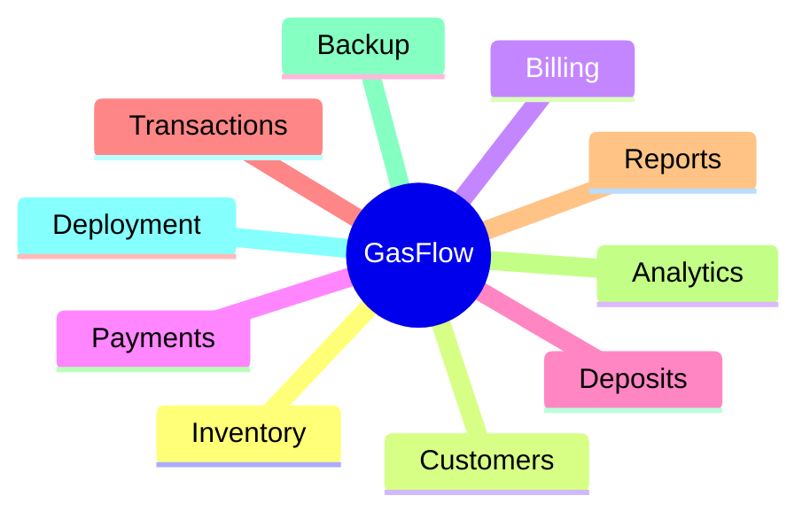
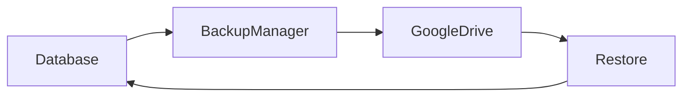

# Gasflow-management-system

GasFlow is a desktop-based Gas Agency Management System that was a project made for one of my clients which streamlines cylinder inventory, customer records, billing, payments, deposits, and refilling workflows. It provides real-time tracking, analytics, invoice generation, Excel/CSV exports, and Google Drive backup, helping agencies replace manual processes with a user-friendly solution.

\## Core Modules

\- Dashboard

\- Inventory Management

\- Customer Management

\- Transactions

\- Billing \& GST

\- Payments \& Deposits

\- Reporting \& Analytics

\- Google Drive Backup

\## Key Highlights

\- Desktop Application

\- Real-World Business Use Case

\- Layered Architecture

\- Data Validation Rules

\- Analytics \& Reporting

\- Backup \& Recovery

\## Documentation

Detailed project documentation is available in the `/documentation` folder.

