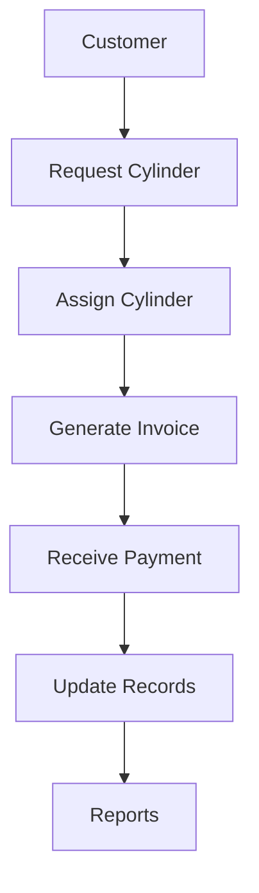
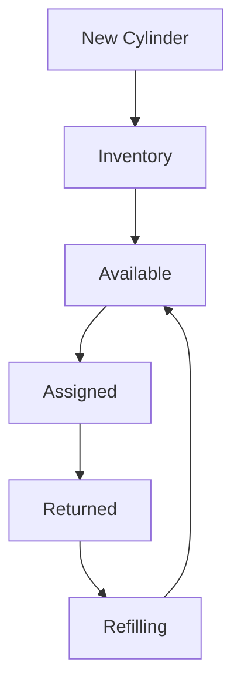
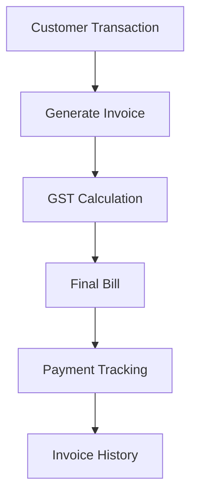

\# Features

\## Cylinder Inventory

\- Unique Cylinder IDs

\- Filled Cylinder Tracking

\- Empty Cylinder Tracking

\- Refill Tracking

\- Cylinder Status Monitoring

\- Cylinder History

\## Customer Management

\- Unique Customer IDs

\- Customer Records

\- Contact Information

\- Cylinder Assignment History

\- Transaction History

\## Billing

\- Invoice Generation

\- GST Support

\- Billing Records

\- Invoice History

\## Payments \& Deposits

\- Payment Tracking

\- Deposit Tracking

\- Outstanding Balance Monitoring

\## Dashboard

\- Inventory Overview

\- Customer Statistics

\- Payment Status

\- Operational Alerts

\## Reporting

\- Sales Reports

\- Inventory Reports

\- Customer Reports

\- Excel Export

\- CSV Export

\- Power BI Integration

\## Backup

\- Google Drive Backup

\- Restore Functionality

\## Deployment

\- Packaged Desktop Application

\- Local Database Storage

