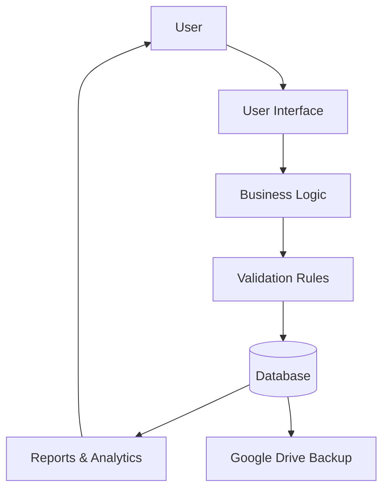
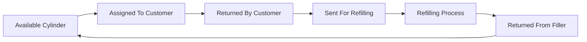

\# System Architecture

\## Layered Design

GasFlow follows a layered software architecture.

User

↓

User Interface

↓

Business Logic

↓

Validation Rules

↓

Database

↓

Reporting \& Analytics

Google Drive Backup operates alongside the system for data protection.

\## User Interface Layer

Pages:

\- Dashboard

\- Customers

\- Inventory

\- Transactions

\- Billing

\- Reports

\- Settings

\## Business Logic Layer

Responsible for:

\- Cylinder assignment

\- Cylinder returns

\- Refill workflows

\- Billing calculations

\- Payment processing

mermaid
flowchart TD

A[Customer]

A --> B[Request Cylinder]

B --> C[Assign Cylinder]

C --> D[Generate Invoice]

D --> E[Receive Payment]

E --> F[Update Records]

F --> G[Reports]

\## Validation Layer

Responsible for:

\- Unique IDs

\- Status verification

\- Invoice validation

\- Input validation

\## Data Layer

Stores:

\- Customers

\- Cylinders

\- Transactions

\- Bills

\- Payments

\- Deposits

