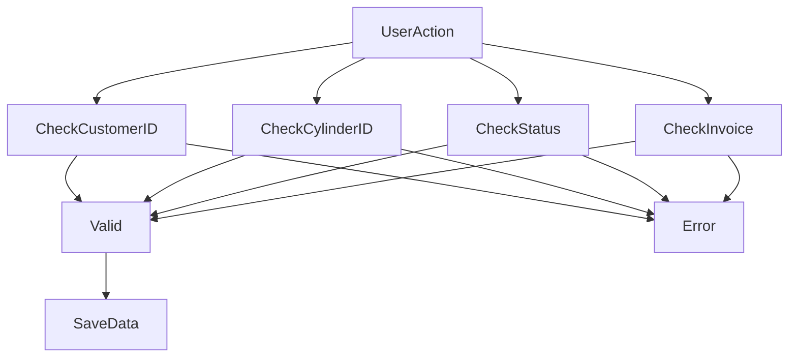

\# Validation Rules

\## Customer Rules

✓ Customer ID must be unique

✓ Phone number must be valid

✓ Required fields cannot be empty

\## Cylinder Rules

✓ Cylinder ID must be unique

✓ Cylinder cannot be assigned twice

✓ Cylinder status must be valid

✓ Expired cylinders cannot be assigned

\## Billing Rules

✓ Invoice number must be unique

✓ Invoice amount must be valid

✓ Customer must exist

\## Payment Rules

✓ Payment cannot exceed balance

✓ Deposit records must be tracked

\## Error Handling

The system provides clear messages when validation fails.

Examples:

\- Duplicate Customer ID

\- Duplicate Cylinder ID

\- Invalid Phone Number

\- Cylinder Already Assigned

\- Invoice Already Exists

